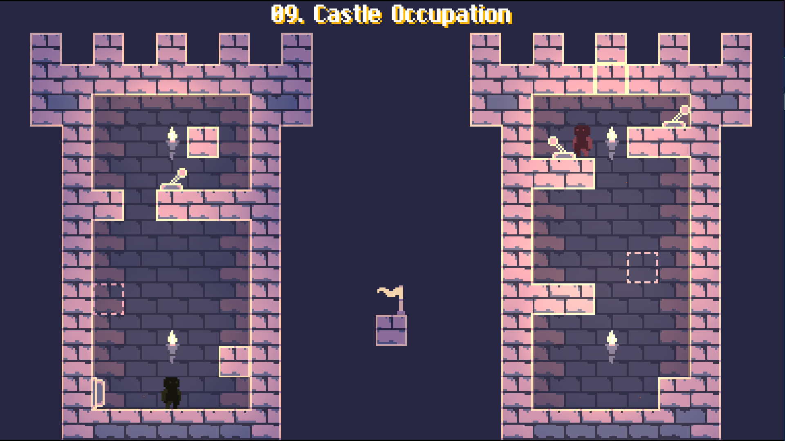
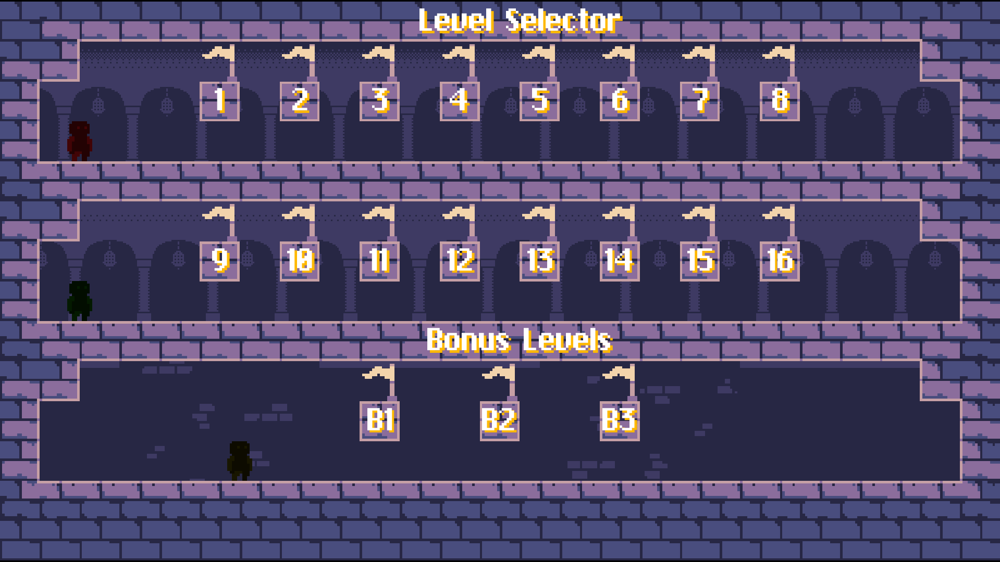

# Stack 'em Up

A little puzzle plattformer made for Brackeys Game Jam 2021. The game is about maneuvering multiple players through single screen levels.

## You can play it [here](https://crysaac.itch.io/stack-em-up)!

We made all art, code and sound effects ourselves.

If you want, you can switch on the timer in the settings menu and send us your time in the ending screen!

The controls will be shown in-game but in case you forget them:

Move with WASD
Jump with W or SPACE
Switch controlled player with TAB
Stack players with E, unstack with Q
Throw players with SHIFT
Reset with R
Open Menu with ESCAPE

This project is open source:

https://github.com/MarianZuska/stack-em-up 

Music by: DeltaBreaker on OpenGameArt
Font by: Giles Booth on Pentacom
